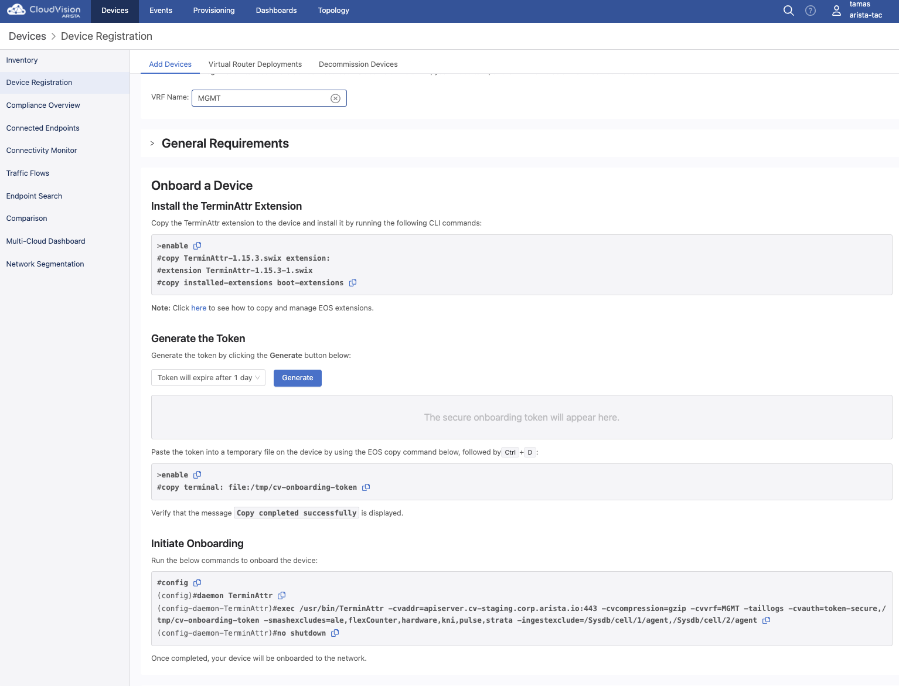

# cvop2cvaas

Migrate all devices, containers and configlets from CV on-prem to CVaaS. 
The `cvaas_migration.yaml` playbook does the following:
- collects cvp facts (devices, containers and configlets) from the on-prem CVP system and stores it in memory
- fetches the devices in the inventory and builds a new inventory file to be used later
- generates TerminAttr onboarding token from CVaaS
- uploads the generated token to all devices using scp
- configures the devices with the TerminAttr config pointing to CVaaS
- pushes all the configlets from on-prem to CVaaS
- creates the container hierarchy (learned from the on-prem facts)
- moves the devices to their target container and applies the configlets
- creates a new TerminAttr configlet pointing to CVaaS and appends it to the list of configlets for each device

## Prerequisites

- python3
- [ansible-cvp](https://cvp.avd.sh)
- [cvprac 1.0.7+](https://github.com/aristanetworks/cvprac/tree/develop/docs/labs)
- scp (`pip install scp` or `pip3 install scp`) <-- Check with `pip --version` if it points to py2 or py3
- devices should run TerminAttr 1.15.3 (CVaaS requirement)
- devices should run EOS 4.23+ for non-prod clusters and 4.22+ for prod clusters (CVaaS requirement)
- all devices must have internet connectivity and be able to reach CVaaS, a quick ping test should be enough:

```shell
ping vrf MGMT apiserver.cv-staging.corp.arista.io
ping vrf MGMT www.cv-staging.corp.arista.io
```

## Steps

1. Generate service account token on CVaaS


The token should be copied and saved to a file that can later be referred to, in my example it's in `/Users/tamas/tokens/cvaas.tok`.

2. Generate service account token on CV on-prem (same steps apply as above), save it to a file (e.g.: `/Users/tamas/tokens/go178.tok`)

>NOTE if you choose different names for your tokens then make sure to update your playbook

3. Go to CVaaS UI and generate the TerminAttr config and update the playbook under the `"Configuring TerminAttr on {{ inventory_hostname }}"` task
and under `terminattr_config_cvaas` variable



4. Update the `./inventory/inventory.yaml` file with the right credentials and IPs/FQDNs

5. Update `ansible.cfg` to point to the right folders for your `collections_paths` or just install ansible-cvp using ansible-galaxy and use that instead.

6. Finally run it as `ansible-playbook cvaas_migration.yaml -i inventory --skip-tags debug`

## Disclaimer

This is a proof-of-concept demo, highly recommended to take a backup before running the playbook.


## TO-DO

- parametrize more things
- add TA config into a file
- figure out why `search_key: serialNumber` doesn't work

End to end example can be watched at [youtube](https://www.youtube.com/watch?v=rN6meAtXqss)