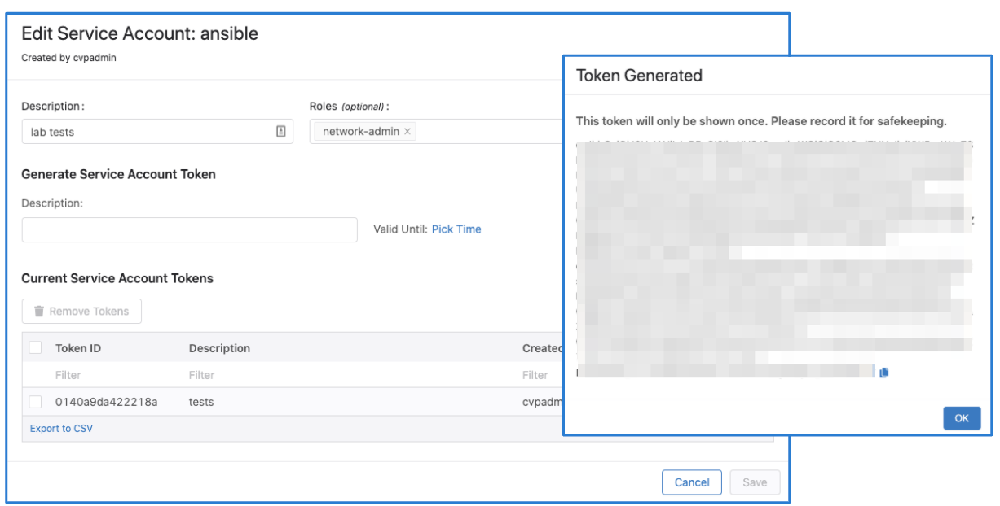

# CVaaS Migration playbook example

Migrate all devices, containers and configlets from CV on-prem to CVaaS. 
The `cvaas_migration.yaml` playbook does the following:

- collects cvp facts (devices, containers and configlets) from the on-prem CVP system and stores it in memory
- fetches the devices in the inventory and builds a new inventory file to be used later
- generates TerminAttr onboarding token from CVaaS
- uploads the generated token to all devices using scp
- configures the devices with the TerminAttr config pointing to CVaaS
- pushes all the configlets from on-prem to CVaaS
- creates the container hierarchy (learned from the on-prem facts)
- moves the devices to their target container and applies the configlets
- creates a new TerminAttr configlet pointing to CVaaS and appends it to the list of configlets for each device

## Prerequisites

- python3 3.8+
- [ansible-cvp](https://cvp.avd.sh)
  - `$ ansible-galaxy collection install arista.cvp`
- [Minimum cvprac 1.0.7, recommended 1.3.1+](https://github.com/aristanetworks/cvprac/): `pip install cvprac>=1.3.1`
- scp (`pip install scp` or `pip3 install scp`) <-- Check with `pip --version` if it points to py2 or py3
- see more package and version requirements at [cvp.avd.sh](https://cvp.avd.sh/en/stable/docs/installation/requirements/)
- devices should run TerminAttr 1.15.3 (CVaaS requirement)
- devices should run EOS 4.23+ for non-prod clusters and 4.22+ for prod clusters (CVaaS requirement)
- all devices must have internet connectivity and be able to reach CVaaS, a quick ping test should be enough like below:

```shell
ping vrf MGMT apiserver.cv-staging.corp.arista.io
ping vrf MGMT www.cv-staging.corp.arista.io
```

## Authentication Prerequisites

CloudVision Service uses OAuth & SAML providers for user authentication. Users are created with a username and an email address, and the email address will be used for OAuth/SAML authentication. 
To perform configuration changes in an EOS device using the CloudVision Service, the same user account must be in the device configuration unless you have AAA authentication enabled via Radius/TACACS+. 

For Eg: assuming `john.smith@company.com` is the email address used for OAuth authentication you need to have `john.smith` as a user in the EOS device (or in the RADIUS/TACACS+ server):

```eos
sw(config)#username john.smith privilege 15 role <roleName> <nopassword/secret>
```

### A note on service accounts

IMPORTANT The name of the service account must match a username configured to be authorized on EOS, otherwise device interactive API calls might fail due to authorization denial.
When using service accouns, on ansible side the `ansible_user` variable must be always `cvaas` (for accessing CVaaS), or `svc_account` (for accessing on-prem or CVaaS).
The `cvaas` and `svc_account` are special variable names to notify the client to switch to using service accounts instead of creating a session using the login API with username/password.
For example when using service accounts we would have the following:

- on the CV UI the username in Users page and Service Accounts page would be john.smith
- on EOS in the running config there would be either a local user: `username john.smith privilege 15 role <roleName> <nopassword/secret>` or one in TACACS/RADIUS
- on ansible side in inventory.yaml the `ansible_user` has to be set to `cvaas` or `svc_account`, e.g.:  `ansible_user: cvaas` or `ansible_user: svc_account` 
  and `ansible_password` will reference the service account token, e.g.: `"{{ lookup('file', '/tokens/cvaas.tok')}}"`

## Steps

### Option 1 - Generate TerminAttr Config on the fly

This example is more of a faster approach for lab environments

1\. Generate service account token on CVaaS ([steps](#how-to-generate-service-accounts))

> NOTE The token should be copied and saved to a file that can later be referred to, in this example it's in `/tokens/cvaas.tok`.
> Please check the authentication requirements in [svcreqs](#a-note-on-service-accounts)

2\. Generate service account token on CV on-prem ([steps](#how-to-generate-service-accounts)), save it to a file (e.g.: `/tokens/go178.tok`)

3\. Export the tokens as env vars, e.g.:

```shell
export CVAAS_TOKEN=`cat /tokens/cvaas.tok`
export ON_PREM_TOKEN=`cat /tokens/go178.tok`
```

> Tip: Add them to your `.bashrc` or `.zshrc` to make them persistent and source them on the current terminal (`source ~/.zshrc`) or start a new session.

4\. Go to CVaaS UI and generate the TerminAttr config and update the playbook under the `"Configuring TerminAttr on {{ inventory_hostname }}"` task
and inside the [terminattr.cfg](./terminattr.cfg) file


5\. Update the `./inventory/inventory.yaml` file with the right credentials and IPs/FQDNs

6\. Update `ansible.cfg` to point to the right folders for your `collections_paths` or just install ansible-cvp using ansible-galaxy and use that instead.

7\. Generate the device inventory with `ansible-playbook cvaas_migrationV2.yaml -i inventory --tags devinv`

8\. Finally run it as `ansible-playbook cvaas_migrationV2.yaml -i inventory --skip-tags=debug,devinv`


### Option 2 - Stream to both on-prem and CloudVision-As-a-Service

This example is recommended for production.

1\. Update the `./inventory/inventory.yaml` file with the right credentials and IPs/FQDNs

2\. Update `ansible.cfg` to point to the right folders for your `collections_paths` or just install ansible-cvp using ansible-galaxy and use that instead.

3\. Generate service account token on CVaaS ([steps](#how-to-generate-service-accounts))

> NOTE The token should be copied and saved to a file that can later be referred to, in this example it's in `/tokens/cvaas.tok`.
> Please check the authentication requirements in [svcreqs](#a-note-on-service-accounts)

4\. Generate service account token on CV on-prem ([steps](#how-to-generate-service-accounts)), save it to a file (e.g.: `/tokens/go178.tok`)

5\. Export the tokens as env vars, e.g.:

```shell
export CVAAS_TOKEN=`cat /tokens/cvaas.tok`
export ON_PREM_TOKEN=`cat /tokens/go178.tok`
```

> Tip: Add them to your `.bashrc` or `.zshrc` to make them persistent and source them on the current terminal (`source ~/.zshrc`) or start a new session.

6\. Go to CVaaS UI and generate the TerminAttr config and build the new TerminAttr configuration to stream to both the existing on-prem cluster and CVaaS. An example can be found in the [TerminAttr most commonly used flags documentation](https://aristanetworks.force.com/AristaCommunity/s/article/terminattr-most-commonly-used-flags-and-sample-configurations) or in the [terminattr_multi_cluster.cfg](./terminattr_multi_cluster.cfg) file


7\. Run `ansible-playbook option2_terminattr_multi_cluster.yaml --tags build` to generate the TerminAttr onboarding tokens for both on-prem and CVaaS and to generate the `onprem_devices.yaml` inventory file

8\. Run `ansible-playbook option2_terminattr_multi_cluster.yaml --tags deploy -i inventory` to upload the tokens and reconfigure TerminAttr to stream to both clusters and wait for the devices to show up in the Undefined container on CVaaS UI.

>NOTE At this stage you should see the devices in the Undefined Container on your CVaaS tenant and on the on-prem cluster in their target container and out of configuration compliance.

9\. Make sure the `terminattr_multi_cluster.cfg` file is updated as well and contains the multi-cluster streaming configuration.

10\. Finally, run the playbook to migrate the containers, configlets, move the devices to their intended containers and assign the configlets to the containers and devices:
 `ansible-playbook option2_cvaas_migration.yaml -i inventory`

> NOTE At this change you should have the configlets uploaded, the containers created and `Add Device` tasks created for all the devices to move to their target containers and configlets to be attached.

11\. Create a Change control from all the tasks, review and approve (there should be no config change).

12\.  Later when the on-prem servers will be decommissioned the TerminAttr configuration can be changed to stream only to CVaaS.

## Disclaimer

- This is a proof-of-concept demo, highly recommended to take a backup before running the playbook.
- Tested with ansible-cvp `v3.3.1` and `v3.5.1` (`v3.4.0` is not supported
  due to [issue#508](https://github.com/aristanetworks/ansible-cvp/issues/508)),
  but recommended to use the latest ansible-cvp for speed optimizations
- configlet builders are not exported during this process

## TO-DO

- export Studio templates
- export Dashboards
- export tags
- figure out why `search_key: serialNumber` doesn't work

End to end example can be watched at [youtube](https://www.youtube.com/watch?v=rN6meAtXqss)

## Appendix

### How to generate service accounts


